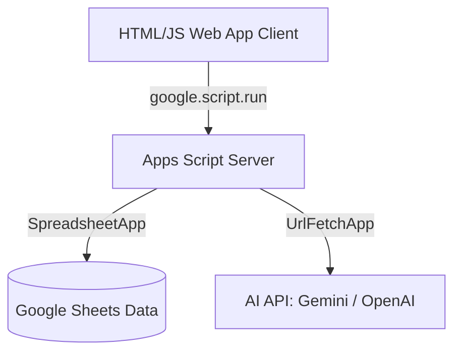

# Project Handover Guide (IT/Maintenance)

This guide provides technical reference documentation for the maintenance and operations of the **Customer Insight Dashboard** Google Apps Script application.

## 1. Executive Summary
The Customer Insight Dashboard is a web application built entirely on Google Apps Script (GAS) that serves as an interactive data visualization and tracking workspace. It connects to a Google Sheets data source, processes metrics dynamically, and uses AI (Google Gemini or OpenAI) to generate retention strategies and call scripts for customers classified as "At Risk" or "Growth Opportunities."

---

## 2. System Purpose & User Roles
The application restricts data access dynamically at runtime based on the authenticated user's role:

- **Director (Director):** Full system access. Can view all zones, configure system-wide API credentials and AI prompts, modify user permissions, and unlock advanced configurations.
- **Area Manager (AM):** Mid-level access. Can view aggregated metrics and customer lists for their assigned zones. Can use AI features but cannot configure system settings or modify other users.
- **Business Development (BD):** Frontline access. Assigned to a specific single zone. Can only see customer data within their assigned scope and update local follow-up notes/status pills.

---

## 3. Architecture Overview

- **Client Side:** SPA (Single Page Application) styled using native CSS variables (OKLCH palette). Handles routing, skeleton states, interactive charts, and client-side validation.
- **Server Side:** Handles database reads/writes, authentication, session tokens (using Script Properties), activity logging, and third-party API routing.

---

## 4. Apps Script File Map
- `src/Body.html`: Core HTML skeleton, main tab wrappers, modals (login, help, settings).
- `src/Scripts.html`: Frontend application logic, tab routing (`swMain`), UI state managers, and network handlers.
- `src/Styles.html`: Custom UI themes, layout grids, keyframe animations, and skeleton shimmer designs.
- `src/DesignV2.html`: Additional visual components and secondary layouts.
- `src/Auth.js`: User authentication, session management, and role validation.
- `src/Config.js`: Global configuration constants (e.g. sheet names, column mappings).
- `src/DataReader.js`: Reading and processing methods for metric sheets.
- `src/Tracking.js`: Database write operations for customer follow-up statuses and notes.
- `src/GeminiService.js`: AI API abstraction layer (supporting Gemini & OpenAI), settings retrieval, and troubleshooting ticket submission.

---

## 5. Google Sheets Structure
The backend expects the spreadsheet to contain the following sheets:
1. `Users`: List of usernames, hashed passwords, roles, email addresses, and zone assignments.
2. `Raw-KPI-{Month}` (e.g. `Raw-KPI-Jan`): Column-based monthly performance logs containing agent metrics (Revenue, Volume, Avg Rev/day).
3. `System_Issues_Logs`: Saved troubleshooting reports filed by users via the Help modal.
4. `AI_Followup_Logs`: Audit logs containing all requests sent to the AI service.

---

## 6. Security & Masking Policy
- **Sensitive Key Masking:** All API keys loaded into the configuration UI are masked on read (e.g., returning `sk-...4a5f` or `gemi...23ab`). They are only overwritten in the Script Properties if the user explicitly submits a new, unmasked key.
- **Export Control:** Bulk data exports and sheet download path features are strictly blocked at the backend.
- **Data Scope Enforcement:** All database queries automatically filter results against the user's assigned zone scope.

---

## 7. AI Features & Provider Configuration
The application supports two AI providers:
- **Google Gemini (Default):** Models `gemini-1.5-flash`, `gemini-2.0-flash`, `gemini-2.5-flash`.
- **OpenAI:** Models `gpt-4o-mini`, `gpt-4o`.

### Configuration Script Properties:
| Property Name | Purpose | Example Value |
|---|---|---|
| `AI_PROVIDER` | Selected provider | `gemini` or `openai` |
| `GEMINI_API_KEY` | Google AI Studio Key | `AIzaSy...` |
| `OPENAI_API_KEY` | OpenAI API Key | `sk-proj-...` |
| `GEMINI_DEFAULT_MODEL` | Default model | `gemini-2.0-flash` |
| `OPENAI_DEFAULT_MODEL` | Default model | `gpt-4o-mini` |
| `ADMIN_EMAIL` | Target email for alerts | `support@example.com` |

---

## 8. Deployment & Clasp Workflow
To build and deploy changes to the live Apps Script environment:

1. Clone or pull the repository.
2. Log in using clasp:
   ```bash
   clasp login
   ```
3. Push changes to the Apps Script project:
   ```bash
   clasp push
   ```
4. Deploy a new version:
   ```bash
   clasp deploy --version <number> --description "Description of changes"
   ```
