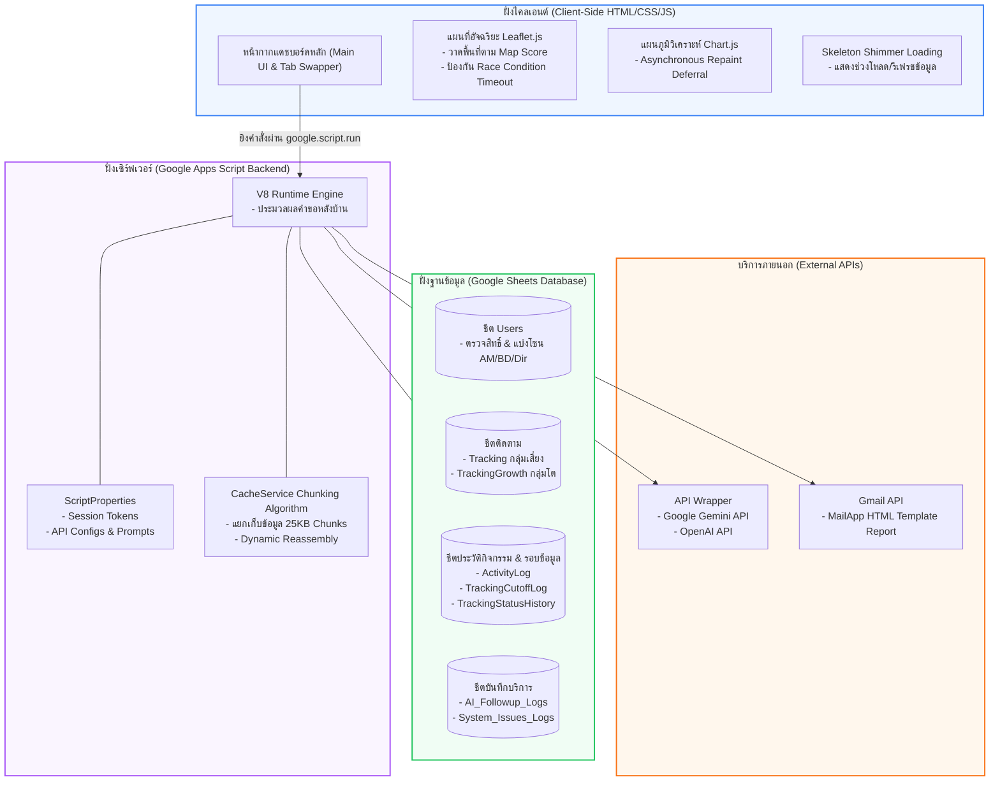
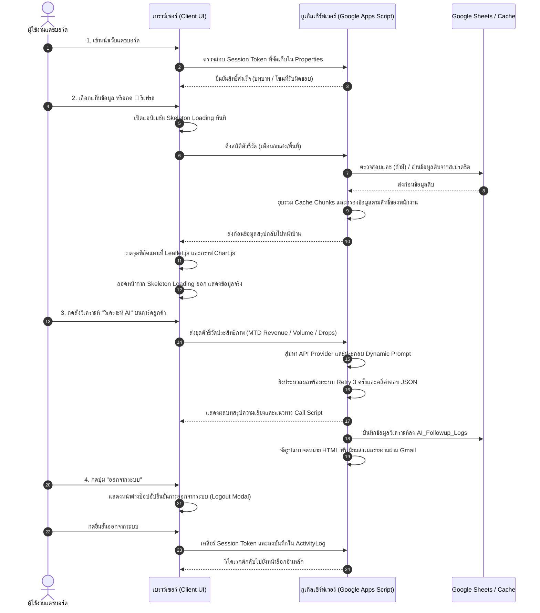

# คู่มือสรุปการเข้าทำงานและการส่งมอบโครงการ (Project Handover Documentation)
## ระบบ: Customer Insight & Performance Tracking Dashboard
### สารบัญข้อมูลทางเทคนิคและการออกแบบสถาปัตยกรรมขั้นลึก (Deep-Dive Developer & Maintenance Manual)

---

## 1. บทนำ (Introduction)

เอกสารฉบับนี้จัดทำขึ้นเพื่อใช้สำหรับการ**ส่งมอบโครงการ**และ**แนะนำการเข้าทำงานสำหรับวิศวกรซอฟต์แวร์หรือแผนกไอที** ที่เข้ามารับช่วงดูแลรักษาระบบต่ออย่างเต็มรูปแบบ

ระบบ **Customer Insight & Performance Tracking Dashboard** เป็นเว็บแอปพลิเคชันวิเคราะห์ข้อมูลผู้ประกอบการ (Agent) ทั่วประเทศแบบฝังตัว (Container-Bound Web Application) บนแพลตฟอร์ม **Google Apps Script (GAS)** โดยดึงข้อมูลประมวลผลโดยตรงจาก **Google Sheets** ที่ทำหน้าที่เป็น Relational Database ระบบรองรับการทำงานสลับภาษา (ไทย/อังกฤษ) มีหน้าจอควบคุมภาพภูมิศาสตร์ (Leaflet.js) แผนภูมิวิเคราะห์ระดับสูง (Chart.js) และบริการปัญญาประดิษฐ์อัจฉริยะ (Gemini/OpenAI Integration) พร้อมระบบรักษาความปลอดภัยระดับองค์กร

---

## 2. สถาปัตยกรรมระบบโดยละเอียด (System Architecture)

ระบบประมวลผลแยกหน้าที่ระหว่างฝั่งไคลเอนต์และเซิร์ฟเวอร์แบบคลาวด์อย่างอิสระ (Decoupled Client-Server Stack) เพื่อความยืดหยุ่นในการขยายขีดความสามารถ:



### 2.1 โครงสร้างฝั่งหน้าบ้าน (Client-Side Stack & UI Lifecycle)
- **สแต็กเทคโนโลยี**: HTML5 Semantic Elements ร่วมกับ CSS3 Grid และ Flexbox Layout ตกแต่งผ่าน CSS Custom Properties (Variables)
- **ขอบเขตแผนที่เชิงรหัสพิกัดภูมิศาสตร์ (Interactive Mapping)**: ใช้ **Leaflet.js** ในการวาดชั้นข้อมูล Zone (GeoJSON Layer) แสดงขอบเขตพื้นที่เป็นกลุ่มสีตามเกณฑ์ผลงาน (Map Score) ป้องกันความล้าหลังของการเรนเดอร์ในกรณีเปลี่ยนพิกัดด้วยฟังก์ชันยกเลิก Timeout (`window._resetMapTimeout`)
- **แผนภูมิรายงานประสิทธิภาพ**: ใช้ **Chart.js** บนแท็บวิเคราะห์ (Overview) โดยระบบจะหน่วงเวลาโหลดกราฟ (Asynchronous Repaint Deferral) ผ่าน `setTimeout` ประมาณ 40 มิลลิวินาทีหลังการสลับแท็บ เพื่อให้แอนิเมชันตอนแท็บสไลด์ไม่เกิดการกระตุก (Lag reduction)
- **แอนิเมชันโครงร่างจำลอง (Skeleton Loading Overlay)**: เมื่อมีการกดเปลี่ยนแท็บหรือกดปุ่มรีเฟรชข้อมูล ระบบจะเพิ่มคลาส `.open` ให้กับตัวครอบโครงร่างสแกนหน้าจอสีเทาเรืองแสง (`_showSkeleton`) ซ้อนทับข้อมูลชุดเก่าทันที ป้องกันหน้าจอโล่งเงียบ และจะถอดออกโดยอัตโนมัติเมื่อฝั่งเซิร์ฟเวอร์ตอบกลับสำเร็จ

### 2.2 โครงสร้างฝั่งหลังบ้าน (Server-Side Engine)
- **การประมวลผล**: ทำงานผ่าน V8 engine ของ Google Apps Script รองรับฟีเจอร์ JavaScript ES6+ แบบเต็มรูปแบบ
- **การจัดเก็บข้อมูลถาวรในระบบ (PropertiesService)**: ใช้ **ScriptProperties** เพื่อทำหน้าที่เก็บ Session Token ของผู้ใช้งาน, ข้อมูลประวัติการเดารหัสผ่าน, และเป้าหมายการทำงานประจำเดือน เพื่อลดความเร็วในการดึงไฟล์ข้อมูลบ่อยครั้ง
- **กลไกการจัดเก็บแคชประสิทธิภาพสูง (CacheService Chunking Algorithm)**:
  เนื่องจากข้อมูลรายชื่อผู้ประกอบการรวมทั้งประเทศมีขนาดใหญ่เกินขีดจำกัดของกูเกิลแคชต่อชิ้น (ขีดจำกัดคือ 100KB) ระบบในไฟล์ `Cache.js` จึงแปลงออบเจกต์เป็นสตริงข้อความ แล้วแบ่งเก็บลงแคชเป็นส่วนๆ (Chunks ขนาดไม่เกิน 25,000 ตัวอักษร) พร้อมคีย์เมทาดาต้าประวัติการสร้าง และดึงกลับมารวมก้อนใหม่แบบไดนามิกตอนผู้ใช้เรียกใช้งาน (Reassembly)

---

## 3. แผนผังกระบวนการทำงานหลัก (System Workflow)

ระบบมีขั้นตอนการไหลของข้อมูลและการดำเนินการตั้งแต่ผู้ใช้เปิดหน้าจอระบบจนถึงการสั่งงาน AI ดังแสดงในแผนภาพกระบวนงานด้านล่างนี้:



1. **การยืนยันตัวตน (Authentication)**: ผู้ใช้งานผ่านการกรองข้อมูลด้วยรหัสผ่านความปลอดภัยสูงและกำหนด Session ประจำเซสชัน
2. **การกรองข้อมูล (Data Filtering)**: กรองรายชื่อและข้อมูลผู้ประกอบการตามขอบเขตพื้นที่ที่สิทธิ์ผู้ใช้งานมีสิทธิ์มองเห็นเท่านั้น
3. **การเรนเดอร์ภาพ (Visualization)**: หน้าจอประมวลผลวาดจุดพิกัดแผนที่ Leaflet และวาดกราฟเส้น Chart.js ประเมินแนวโน้ม
4. **วิเคราะห์ AI เฉพาะราย (AI Recommendation)**: เมื่อเลือก Agent จะส่งข้อมูลตัวชี้วัด MTD ไปให้ AI ช่วยคำนวณบทพูดวิเจรจา (Call Script)
5. **การส่งต่อผลงาน (Report Dispatch)**: ส่งผลลัพธ์คำแนะนำไปทางอีเมลของผู้ตรวจงานทันที เพื่อให้พร้อมทำงานได้นอกสถานที่

---

## 4. ระบบวิเคราะห์และปัญญาประดิษฐ์อัจฉริยะ (Deep-Dive AI Engine)

ระบบ AI ในไฟล์ [GeminiService.js](file:///c:/Users/User/OneDrive/Desktop/Dashboard/src/GeminiService.js) ออกแบบมาให้มีประสิทธิภาพและยืดหยุ่นสูง รองรับการสลับไปมาระหว่างโมเดลชั้นนำด้วยสถาปัตยกรรมแบบส่งต่อแบบห่วงโซ่ (API Wrapper & Fallback Architecture):

```mermaid
flowchart TD
    Start([ไคลเอนต์ส่งคำขอวิเคราะห์]) --> CheckProvider{เช็คสิทธิ์ตัวแปร AI_PROVIDER<br>ใน Script Properties}

    CheckProvider -- "gemini (ค่าเริ่มต้น)" --> GeminiBranch[ดึงคีย์ GEMINI_API_KEY]
    CheckProvider -- "openai" --> OpenAiBranch[ดึงคีย์ OPENAI_API_KEY]

    GeminiBranch --> GeminiModels[ลำดับโมเดลใช้งาน:<br>1. gemini-2.0-flash<br>2. gemini-2.5-flash]
    OpenAiBranch --> OpenAiModels[ลำดับโมเดลใช้งาน:<br>1. gpt-4o-mini<br>2. gpt-4o]

    GeminiBranch --> PromptAssembly[ประกอบ Dynamic Prompt เฉพาะงาน:<br>- Followup Prompt (ดูแลลูกค้า)<br>- Trouble Prompt (ปัญหาระบบ)<br>- Page Analysis (บอทแชทสด)]
    OpenAiBranch --> PromptAssembly

    PromptAssembly --> ExecuteAPI{ยิงเรียก API<br>(ลูปสูงสุด 3 ครั้ง)}

    ExecuteAPI -- "สำเร็จ (HTTP 200)" --> Sanitization[ล้าง Markdown Tags<br> ด้วย Regex Clean]

    ExecuteAPI -- "ล้มเหลวชั่วคราว (503 / 429)" --> Backoff[หน่วงเวลา Exponential Backoff<br>Utilities.sleep attempt * 1.2 วินาที]
    Backoff --> ExecuteAPI

    ExecuteAPI -- "สิทธิ์/โควตาหมดถาวร" --> Fallback[สลับไปใช้โมเดลสำรองถัดไปในลิสต์]
    Fallback --> ExecuteAPI

    Sanitization --> ParseJSON[แปลงผลเป็น JSON Object<br>บังคับคืนค่า summary & guideline]

    ParseJSON --> Output[1. แสดงผลหน้า Dashboard<br>2. ส่ง HTML Report เข้า Gmail]

    style Start fill:#eff6ff,stroke:#3b82f6,stroke-width:2px
    style CheckProvider fill:#faf5ff,stroke:#a855f7,stroke-width:2px
    style ExecuteAPI fill:#fff7ed,stroke:#f97316,stroke-width:2px
    style Output fill:#f0fdf4,stroke:#22c55e,stroke-width:2px
```

### 4.1 การตั้งค่าโมเดลและพาร์ทเนอร์ API (API & Model Routing)
ระบบสามารถปรับแต่งและเลือกเครื่องยนต์ประมวลผล AI ได้จากหน้าตั้งค่าระบบ (Settings) โดยเก็บคีย์ไว้ใน Script Properties:
1. **Gemini API Engine**:
   - มองหาโมเดลเริ่มต้นจากคีย์ `GEMINI_DEFAULT_MODEL` (หากไม่มีจะใช้ค่าเริ่มต้นเป็น `gemini-2.0-flash`)
   - รายการสำรองกรณีมีปัญหาโค้วตาขัดข้อง: `gemini-2.0-flash`, `gemini-2.5-flash`
   - จุดเชื่อมต่อ API: `https://generativelanguage.googleapis.com/v1beta/models/{modelName}:generateContent?key={apiKey}`
2. **OpenAI API Engine (Fallback)**:
   - มองหาโมเดลเริ่มต้นจากคีย์ `OPENAI_DEFAULT_MODEL` (หากไม่มีจะใช้ค่าเริ่มต้นเป็น `gpt-4o-mini`)
   - จุดเชื่อมต่อ API: `https://api.openai.com/v1/chat/completions`

### 4.2 โครงสร้างของข้อมูลนำส่งและการบังคับผลลัพธ์ (API Payload Schema)
เพื่อให้หน้าบ้านสามารถถอดรหัสข้อความไปแสดงผลบนกล่องแชทและส่งเข้าอีเมลได้อย่างไร้รอยต่อ ระบบจะตั้งค่าพารามิเตอร์การตอบกลับเป็นรูปแบบไฟล์ JSON โดยมีโครงสร้างดังนี้:
```json
{
  "summary": "ข้อสรุปทิศทางปัญหาของลูกค้ารายนี้ (ความยาว 2-3 บรรทัด สำหรับแสดงผลบนแดชบอร์ด)",
  "guideline": "แนวทางการปฏิบัติและการเจรจาลูกค้าอย่างละเอียดเป็นข้อๆ (ประกอบด้วย: 1. การวิเคราะห์ปัญหาเบื้องต้น 2. บทสนทนาโทรเจรจา (Call Script) 3. ข้อเสนอหรือแพ็กเกจแนะนำ)"
}
```
และระบุข้อกำหนดพารามิเตอร์ของระบบนำส่งข้อมูล:
- **สำหรับ Gemini**: กำหนดคุณสมบัติ `generationConfig: { responseMimeType: "application/json" }`
- **สำหรับ OpenAI**: กำหนดคุณสมบัติ `response_format: { type: "json_object" }`

### 4.3 โครงสร้างแม่แบบคำสั่งระบบ (Dynamic Prompt Templates)

#### 4.3.1 แม่แบบแผนงานติดตามตัวแทนขนส่ง (`callGeminiFollowupAPI`)
คำสั่งนี้จะถูกประมวลผลเมื่อผู้ใช้กดวิเคราะห์ผลงาน Agent ในกลุ่มเสี่ยงหรือกลุ่มเติบโต ระบบจะดึงค่าจากสเปรดชีตมาจัดวางในรูปแบบคำสั่ง:
```
คุณเป็นผู้เชี่ยวชาญด้านกลยุทธ์การบริหารความสัมพันธ์ลูกค้า (CRM) และการฟื้นฟูยอดขายในประเทศไทย
กรุณาวิเคราะห์ข้อมูลตัวชี้วัดของลูกค้ารายนี้ เพื่อร่างแผนงานติดตามและบทสนทนาการเจรจาเจาะลึกเฉพาะราย:

ชื่อลูกค้า: {name} (รหัส: {code})
กลุ่มประเภท: {segment} (กลุ่มเสี่ยง หรือ กลุ่มเติบโต)
ผู้ดูแล (Agent Name): {agentName}
พิกัดที่ตั้ง: โซน {zone} / จังหวัด {province}
แพ็กเกจปัจจุบัน: {package}

เปรียบเทียบยอดขายเฉลี่ยรายวัน (Revenue/day MTD):
- เดือนฐานเปรียบเทียบ: {prevAvg} บาท/วัน
- เดือนปัจจุบัน: {curAvg} บาท/วัน
- ผลต่างเฉลี่ยต่อวัน: {diffAvg} บาท/วัน ({pctChange})

เปรียบเทียบจำนวนชิ้นเฉลี่ยหรือสะสมรายเดือน:
- จำนวนชิ้นเดือนฐาน: {prevVol} ชิ้น
- จำนวนชิ้นเดือนปัจจุบัน: {curVol} ชิ้น

สัญญาณเตือนหรือเหตุผลการจัดกลุ่ม: {priority}

กรุณาตอบกลับเป็นรูปแบบ JSON ดิบเท่านั้น โครงสร้างตามที่ระบุ...
```

#### 4.3.2 แม่แบบการวิเคราะห์และวินิจฉัยปัญหาทางเทคนิค (`callGeminiTroubleAPI`)
เมื่อผู้ใช้งานระบบกดยื่นปัญหาระบบ (Troubleshooting) ระบบจะนำหมวดหมู่ปัญหาและข้อความบรรยายมาร่างคำสั่งเพื่อให้ AI ช่วยประเมินวิธีการแก้ไขเบื้องต้น:
```
คุณเป็นสถาปนิกซอฟต์แวร์และวิศวกรระบบผู้เชี่ยวชาญด้าน Google Apps Script และ Google Sheets
ผู้ใช้ได้รายงานปัญหาการทำงานของระบบ Dashboard ดังนี้:

หมวดหมู่ปัญหา: {category}
รหัสผู้ใช้รายงาน: {customerCode}
รายละเอียดปัญหาที่เกิดขึ้น: {description}

กรุณาวิเคราะห์หาสาเหตุที่น่าจะเป็นไปได้สูงสุด (Root Cause Analysis) และระบุแนวทางการแก้ไขปัญหาทีละขั้นตอน (Actionable Resolution Steps) เป็นภาษาไทยอย่างชัดเจน โดยแยกออกเป็น:
1. การวิเคราะห์ปัญหาเบื้องต้น
2. ขั้นตอนการตรวจสอบและแก้ไขด้วยตนเอง
3. แนวทางป้องกันเพื่อไม่ให้เกิดปัญหานี้ซ้ำอีกในระบบ

กรุณาตอบกลับเป็นรูปแบบ JSON ดิบเท่านั้น โครงสร้างตามที่ระบุ...
```

#### 4.3.3 แม่แบบการสนทนาวิเคราะห์ข้อมูลหน้าจอแบบเรียลไทม์ (`analyzePageData`)
แชทบอทอัจฉริยะสามารถอ่านค่าสถิติทั้งหมดที่แสดงอยู่บนหน้าจอปัจจุบันของผู้ใช้งาน พร้อมกับนำมาตอบคำถามและวิเคราะห์ข้อมูลเชิงลึกในช่องแชท:
```
คุณคือ AI Insights Assistant ผู้ช่วยวิเคราะห์ข้อมูลธุรกิจอัจฉริยะประจำแดชบอร์ด
นี่คือบริบทและข้อมูลสถิติต่างๆ ในหน้าจอที่ผู้ใช้งานกำลังเปิดดูอยู่ในขณะนี้:

{pageData}

คำสั่งและคำถามล่าสุดจากผู้ใช้งานระบบ: "{userMessage}"

ประวัติการสนทนาก่อนหน้านี้:
{chatHistory}

กรุณาใช้ข้อมูลและตัวเลขที่แสดงในบริบทหน้าจอด้านบนเพื่อตอบคำถามอย่างถูกต้อง แม่นยำ และเป็นมืออาชีพ หลีกเลี่ยงการเดาตัวเลขที่ไม่มีอยู่จริง สรุปประเด็นเป็นข้อๆ และเสนอแนวทางเชิงกลยุทธ์ที่สามารถนำไปปฏิบัติได้จริงเป็นภาษาไทย
```

### 4.4 การตรวจสอบและการส่งต่อผลงาน (Audit Logging & Reporting)
- **ระบบบันทึกความเคลื่อนไหว**: ทุกครั้งที่มีการส่งข้อมูลไปประมวลผลที่ตัวแทน AI ระบบจะบันทึกประวัติการส่งลงในตาราง `logAiFollowupRequest` บันทึกค่าผู้ส่ง เวลา รหัสลูกค้า และผลสรุปย่อที่ AI ตอบกลับมาเพื่อใช้ตรวจสอบการใช้งานคีย์
- **การรวมระบบส่งอีเมลอัตโนมัติ (Gmail Integration)**:
  เมื่อ AI จัดทำแผนงานช่วยเหลือลูกค้าเสร็จสิ้น ระบบหลังบ้านจะเรียกใช้งานฟังก์ชัน `sendFollowupEmail` เพื่อจัดโครงสร้างหน้ารายงานแบบพรีเมียม (HTML Template) มีสีสัน ตารางเปรียบเทียบตัวเลข และบทสนทนาการเจรจา ส่งตรงเข้าสู่อีเมลส่วนตัวของผู้ยื่นขอข้อมูลทันทีผ่านบริการ `MailApp.sendEmail` ของกูเกิล

### 4.5 สถาปัตยกรรมการทำงานเชิงลึกและการจัดการข้อผิดพลาด (Deep-Dive API Mechanics & Error Handling Policy)

เพื่อให้วิศวกรและผู้พัฒนาระบบเข้าใจลอจิกเบื้องหลังการทำงานและสามารถตรวจสอบแก้ไขได้อย่างละเอียด ส่วนนี้จะอธิบายกลไกทางเทคนิคของ AI Engine:

#### 4.5.1 การจัดเส้นทางเลือกผู้ให้บริการ (Dynamic Provider Routing)
ใน `GeminiService.js` ฟังก์ชันทางเข้าหลัก (Unified Entry Points) ได้แก่:
- `callAiFollowupAPI(customerData)` สำหรับวิเคราะห์และร่างบทสนทนาการติดตามลูกค้ากลุ่มเสี่ยง
- `callAiTroubleAPI(category, customerCode, description)` สำหรับประเมินและแนะนำวิธีแก้ไขปัญหาเทคนิคที่ผู้ใช้รายงานเข้ามา
- `callAiPageAnalysisAPI(prompt)` สำหรับประมวลผลกล่องข้อความแชทบอทวิเคราะห์สถิติตัวเลขหน้าจอแบบสด (Page Insights)

ฟังก์ชันทั้งหมดนี้จะอ่านตัวแปรระบบ `AI_PROVIDER` จาก Script Properties เป็นอันดับแรก หากตั้งค่าเป็น `'openai'` ระบบจะผันงานส่งไปยัง API ของ OpenAI (เช่น `callOpenAiFollowupAPI`) ทันที แต่หากไม่มีการกำหนดค่าหรือมีค่าเป็นตัวอื่น ระบบจะส่งไปที่ API ของ Gemini (เช่น `callGeminiFollowupAPI`) เป็นค่าเริ่มต้น

#### 4.5.2 กลไก Failover และการสลับโมเดลสำรองอัตโนมัติ (Automated Retry & Model Failover Chain)
ระบบ AI Engine ได้ออกแบบกระบวนการกู้คืนความผิดพลาดแบบสองชั้น (Dual-Layer Fault Recovery Workflow) เพื่อป้องกันการหยุดชะงักของบริการ:
1. **การสลับโมเดลสำรอง (Model Swapping)**:
   ระบบจะมีอาร์เรย์ของโมเดลตามลำดับความสำคัญ เช่น สำหรับ Gemini จะเริ่มจาก `GEMINI_DEFAULT_MODEL` ที่ตั้งค่าไว้ หากเกิดข้อผิดพลาดจะเปลี่ยนไปใช้โมเดลสำรองในรายการ `['gemini-2.0-flash', 'gemini-2.5-flash']` ทีละลำดับ
2. **การวนซ้ำพร้อมหน่วงเวลาหน่วงหนีการชน (Retry Loop with Exponential Backoff)**:
   สำหรับโมเดลแต่ละตัวที่กำลังลองเรียกใช้ ระบบจะทำลูปยิงขอข้อมูลซ้ำสูงสุด 3 ครั้ง (`attempt = 1` ถึง `3`)
   - หาก API ตอบกลับด้วยรหัสข้อผิดพลาดประเภทชั่วคราว เช่น **HTTP 503 (Service Unavailable)** หรือ **HTTP 429 (Rate Limit / Quota Exceeded ของ Free Tier)** ระบบจะทำการหน่วงเวลาผ่านคำสั่ง `Utilities.sleep(attempt * 1200)` ส่งผลให้รอบที่ 1 หน่วง 1.2 วินาที, รอบที่ 2 หน่วง 2.4 วินาที, และรอบที่ 3 หน่วง 3.6 วินาที ก่อนจะเริ่มยิงใหม่อีกครั้ง
   - หากตรวจเจอข้อผิดพลาดประเภทโควตาของ Free Tier หมดอย่างแน่นอนจากการวิเคราะห์ข้อความผิดพลาด (`quota exceeded` หรือ `free_tier`) ระบบจะตั้งค่าตัวแปร `_quotaHit = true` และข้ามการตรวจสอบโมเดลอื่นๆ ทันทีเพื่อไม่ให้เสียเวลา เนื่องจากขีดจำกัดนี้ผูกติดกับบัญชี API
   - หากเจอข้อผิดพลาดถาวรประเภทอื่น (เช่น คีย์ API ไม่ถูกต้อง หรือเนื้อหาถูกบล็อกโดยเซฟตี้ฟิลเตอร์) ระบบจะไม่วนรอบซ้ำและจะข้ามไปลูปเปลี่ยนโมเดลถัดไปในอาร์เรย์ทันที

#### 4.5.3 การทำความสะอาดข้อมูลคำตอบ (JSON Sanitization & Extraction Algorithm)
บ่อยครั้งที่ผู้ให้บริการ AI ตอบกลับข้อมูลในรูปแบบที่มีมาร์กดาวน์โค้ดบล็อกครอบเอาไว้ (เช่น ` ```json ... ``` `) หรือส่งข้อความอื่นๆ ประกอบหัวท้าย ซึ่งจะทำให้การแปลงสตริงเป็นออบเจกต์ด้วยคำสั่ง `JSON.parse()` เกิดการล้มเหลว (Crash)
ระบบแก้ปัญหานี้โดยการใช้กลไก Sanitizer กรองเอาอักขระที่เป็นปัญหาออกด้วย Regex ก่อนส่งไปแปลงผล:
```javascript
if (rawText.indexOf('```') >= 0) {
  rawText = rawText.replace(/```json/g, '').replace(/```/g, '').trim();
}
```
หากเป็นผลลัพธ์จากโครงสร้างซ้อนลึกของ API Response จากภายนอก ระบบจะดึงพิกัดคอนเทนต์ย่อยออกมาจากตำแหน่ง `candidates[0].content.parts[0].text` และทำความสะอาด Markdown Blocks ก่อนส่งกลับไปแสดงผลบน Dashboard

#### 4.5.4 พารามิเตอร์และการบังคับให้ AI ตอบกลับเฉพาะรูปแบบ JSON (JSON Schema Enforcement)
ระบบระบุอย่างเข้มงวดในคำสั่ง (Prompt Instruction) ให้ตอบกลับเป็น JSON ดิบเท่านั้น และระบุพารามิเตอร์ควบคุมพฤติกรรมใน Payload การยิงส่ง:
- **Gemini API**: กำหนดค่า `"generationConfig": { "responseMimeType": "application/json" }` ในระดับ HTTP Content Body
- **OpenAI API**: กำหนดค่า `"response_format": { "type": "json_object" }` ในระดับ HTTP Content Body

#### 4.5.5 ตารางบันทึกการใช้งานเชิงตรวจสอบ (AI Logs Audit Trail)
ข้อมูลการร้องขอ AI ทุกรายการจะถูกเขียนบันทึกอย่างถาวรในตาราง `AI_Followup_Logs` โดยระบบใช้ฟังก์ชัน `logAiFollowupRequest` บันทึกรายละเอียดข้อมูลดังนี้:
1. **Timestamp**: วันและเวลาที่ยื่นขอวิเคราะห์
2. **ผู้ขอรายงาน**: บัญชีผู้ใช้ (Username) ที่ล็อกอินเข้าใช้งานแดชบอร์ด
3. **รหัสลูกค้า & ชื่อลูกค้า**: ข้อมูลบ่งชี้ตัวแทนจำหน่ายที่เป็นเป้าหมาย
4. **Segment**: จำแนกตามสีกลุ่มความเสี่ยง (`🔴 กลุ่มเสี่ยง` หรือ `🟢 กลุ่มเติบโต`)
5. **ยอดขายเฉลี่ยวันเดือนฐาน / งวดปัจจุบัน / ผลต่างรายได้ / เปอร์เซ็นต์ความเปลี่ยนแปลง**: ข้อมูลทางการเงินดิบที่ใช้ประเมิน ณ วินาทีนั้น
6. **สรุปวิเคราะห์จาก AI**: ข้อมูลสรุปสั้น 2-3 บรรทัดแรก
7. **สถานะการส่งอีเมล**: บันทึกว่าระบบได้จัดส่งบทรายงาน Call Script ไปที่อีเมลส่วนตัวสำเร็จหรือไม่
8. **สถานะการติดตาม**: แสดงประวัติสถานะปัจจุบัน (`รอดำเนินการ`, `ติดต่อแล้ว`, `ช่วยเหลือแล้ว`, `สำเร็จ`, `ปฏิเสธ`)

---

## 5. โครงสร้างฐานข้อมูลใน Google Sheets (Database Schema)

สเปรดชีตทำหน้าที่เป็นแหล่งข้อมูลอ้างอิงหลัก (Relational Database) ของแดชบอร์ด โดยระบบจัดสรรตารางข้อมูลหลักออกเป็นทั้งหมด 10 ชีต เพื่อแยกหน้าที่ในการเก็บประวัติ บันทึกการใช้งาน และตัวชี้วัดประสิทธิภาพรายวัน ดังนี้:

### 5.1 ชีตบันทึกสิทธิ์ผู้เข้าใช้ระบบ (`Users`)
* **จุดประสงค์**: เก็บข้อมูลบัญชีผู้ใช้งาน รหัสผ่านแบบแฮช และขอบเขตพื้นที่รับผิดชอบเพื่อตรวจสิทธิ์ (Authentication & Role-Based Access Control)
* **โครงสร้างและชนิดข้อมูลคอลัมน์**:
  * `Username` (`String`, ห้ามว่าง): ชื่อผู้ใช้งานที่เป็นคีย์ระบุบัญชี
  * `PasswordHash` (`String`, ห้ามว่าง): รหัสผ่านที่แฮชความปลอดภัยสูงด้วยความยาว 64 ตัวอักษร (SHA-256)
  * `Salt` (`String`, ห้ามว่าง): ค่าสุ่มผสมรหัสผ่าน (Salt) ความยาว 16 ตัวอักษรเฉพาะรายบัญชี
  * `Role` (`String`, ห้ามว่าง): ระดับสิทธิ์ควบคุมใช้งาน (`Director` / `AM` / `BD`)
  * `Zones` (`String`): โซนที่ดูแล คั่นด้วยเครื่องหมายจุลภาค เช่น `Zone 1, Zone 2` (กรณี AM หรือ Director บางท่านที่ดูระดับประเทศให้ระบุเป็น `All`)

### 5.2 ชีตบันทึกข้อมูลการติดตามกลุ่มเสี่ยง (`Tracking`)
* **จุดประสงค์**: เก็บบันทึกข้อมูลสถานะความคืบหน้าการดูแลช่วยเหลือตัวแทนกลุ่มเสี่ยง (Risk) ที่มียอดขายตกหรือสัญญาณอันตรายอื่นๆ
* **โครงสร้างและชนิดข้อมูลคอลัมน์ (แปลงหัวตารางภาษาไทย dynamic)**:
  * `agentCode` ➡️ `รหัส Agent` (`String`, ห้ามว่าง): คีย์อ้างอิง Agent
  * `agentName` ➡️ `ชื่อลูกค้า` (`String`): ชื่อร้านค้าผู้ประกอบการ
  * `21.00` ➡️ `รหัสลูกค้า` (`String`): รหัสสาขาย่อยหรือคีย์ลูกค้า
  * `package` ➡️ `แพ็กเกจ` (`String`): แพ็กเกจขนส่งที่ใช้อยู่
  * `city` ➡️ `อำเภอ/เขต` (`String`)
  * `province` ➡️ `จังหวัด` (`String`)
  * `zoneName` ➡️ `Zone` (`String`)
  * `key` ➡️ `Key` (`String`): ตัวจับกลุ่มเงื่อนไขความเสี่ยง เช่น `revenue_drop`
  * `status` ➡️ `สถานะติดตาม` (`String`): Dropdown บังคับ (`รอดำเนินการ`, `ติดต่อแล้ว`, `ช่วยเหลือแล้ว`, `สำเร็จ`, `ปฏิเสธ`)
  * `reason` ➡️ `เหตุผล` (`String`): คำอธิบายหรือสาเหตุที่ยอดตก
  * `note` ➡️ `หมายเหตุ` (`String`): บันทึกข้อมูลการพูดคุยติดตามของพนักงาน
  * `updatedBy` ➡️ `แก้ไขโดย` (`String`): อีเมล/Username ของผู้เข้าแก้ไขล่าสุด
  * `updatedAt` ➡️ `แก้ไขล่าสุด` (`Date/Time`): วันและเวลาที่บันทึกข้อมูลล่าสุด
  * `cutoffPeriod` ➡️ `รอบข้อมูล` (`String`): ระบุงวดรอบการทำงาน เช่น `2026-06-22`
  * **กลุ่มคอลัมน์ความเสี่ยงที่ระบุเกณฑ์ (`TRACKING_CRITERIA_COLUMNS`)**:
    * `criteriaType` ➡️ `ประเภทเกณฑ์` (เช่น `weekly`, `monthly`)
    * `criteriaMetric` ➡️ `เกณฑ์ที่ใช้` (เช่น `rev`, `vol`)
    * `criteriaThreshold` ➡️ `ค่าเกณฑ์`
    * `criteriaSnapshot` ➡️ `รายละเอียดเกณฑ์` (JSON String เก็บค่าตัวเลขประสิทธิภาพขณะเข้าระบบ)
    * `criteriaVersion` ➡️ `เวอร์ชันเกณฑ์`
    * `activeInCurrentCriteria` ➡️ `ยังอยู่ในเกณฑ์ปัจจุบัน` (`TRUE`/`FALSE`)
    * `firstMatchedAt` ➡️ `เข้าเกณฑ์ครั้งแรก` (`Date/Time`)
    * `lastMatchedAt` ➡️ `เข้าเกณฑ์ล่าสุด` (`Date/Time`)
  * **กลุ่มคอลัมน์สถานะระบบงาน (`TRACKING_STATUS_META_COLUMNS`)**:
    * `statusSource` ➡️ `แหล่งที่มาสถานะ` (`String`)
    * `statusVersion` ➡️ `เวอร์ชันสถานะ`
    * `lastDashboardSyncAt` ➡️ `ซิงก์จาก Dashboard ล่าสุด` (`Date/Time`)
    * `lastSheetEditAt` ➡️ `แก้จาก Sheet ล่าสุด` (`Date/Time`)

### 5.3 ชีตบันทึกข้อมูลการติดตามกลุ่มเติบโต (`TrackingGrowth`)
* **จุดประสงค์**: เก็บบันทึกข้อมูลสถานะการติดตามตัวแทนกลุ่มเติบโต (Growth) เพื่ออำนวยความสะดวกในการรักษาความสัมพันธ์และนำเสนอแคมเปญใหม่
* **โครงสร้างและชนิดข้อมูลคอลัมน์**:
  * โครงสร้างเหมือนกับชีต `Tracking` ทุกประการ แต่ถูกสร้างแยกตารางเพื่อความเป็นระเบียบในการกรอง และปรับแต่งการเก็บข้อมูล โดยมีส่วนต่างเล็กน้อยคือ คอลัมน์ที่ 10 จะเก็บข้อมูล `key_success` ➡️ `ปัจจัยเติบโต` แทนคอลัมน์ `reason` ➡️ `เหตุผล` ของกลุ่มเสี่ยง

### 5.4 ชีตบันทึกประวัติสถานะติดตามถาวร (`TrackingStatusHistory`)
* **จุดประสงค์**: เก็บประวัติประเมินผลติดตามตัวแทนย้อนหลังอย่างถาวร (Archive Data) เมื่อเกิดเหตุการณ์ล้างสถานะในรอบการรีเซ็ต Cutoff
* **โครงสร้างและชนิดข้อมูลคอลัมน์**:
  * เหมือนโครงสร้างชีต `Tracking` และ `TrackingGrowth` ทุกคอลัมน์ เพื่อรองรับการสืบค้นข้อมูลประวัติและประเมินผล Streak ของงวดที่แล้วได้จากฝั่งโค้ดหลังบ้าน

### 5.5 ชีตประวัติการเข้าใช้งานและกระทำกิจกรรม (`ActivityLog`)
* **จุดประสงค์**: บันทึกกิจกรรมการใช้งานและเข้าถึงข้อมูลของบัญชีผู้ใช้เพื่อการรักษาความปลอดภัย (Audit Trail)
* **โครงสร้างและชนิดข้อมูลคอลัมน์**:
  * `Timestamp` (`String`): วันและเวลาที่เกิดกิจกรรมในรูปแบบ `yyyy-MM-dd HH:mm:ss`
  * `Username` (`String`): บัญชีผู้ใช้งานที่กระทำการ
  * `Role` (`String`): ระดับสิทธิ์ขณะกระทำ
  * `Action` (`String`): คีย์การกระทำ เช่น `LOGIN`, `LOGOUT`, `VIEW_DASHBOARD`, `CACHE_REFRESH`, `UPDATE_STATUS`
  * `Detail` (`String`): รายละเอียดเพิ่มเติมเชิงสถิติหรือเมทาดาต้า
  * `User-Agent` (`String`): ข้อมูลประเภทบราวเซอร์ อุปกรณ์ และระบบปฏิบัติการของผู้ใช้
  * `Token (Short)` (`String`): สตริงแสดง Token ย่อเฉพาะ 8 หลักสุดท้ายเพื่อจับคู่กิจกรรม

### 5.6 ชีตบันทึกรอบตัดรอบข้อมูล (`TrackingCutoffLog`)
* **จุดประสงค์**: เก็บสถิติบันทึกความคืบหน้าการรีเซ็ตและตัดรอบข้อมูลของระบบหลังบ้าน (Cutoff Tracker)
* **โครงสร้างและชนิดข้อมูลคอลัมน์**:
  * `kind` (`String`): ประเภทกลุ่มข้อมูล (`risk` หรือ `growth`)
  * `cutoffPeriod` (`String`): รอบงวดข้อมูลปัจจุบันที่ถูกล้างและรีเซ็ตค่า (เช่น `2026-06-22`)
  * `previousCutoffPeriod` (`String`): รอบงวดข้อมูลของสัปดาห์/เดือนก่อนหน้า
  * `event` (`String`): ประเภทเหตุการณ์ระบบ (`CUTOFF_RESET`)
  * `loggedAt` (`Date/Time`): วันเวลาที่ถูกรีเซ็ตจริง
  * `resetEffective` (`String`): สถานะการประยุกต์ใช้ในการล้างข้อมูล (`YES` หรือ `YES_ON_PERIOD_CHANGE`)

### 5.7 ชีตประวัติคำขอคำแนะนำจาก AI (`AI_Followup_Logs`)
* **จุดประสงค์**: บันทึกกิจกรรมขอความเห็น แผนงาน บทเจรจาจาก AI และการส่งอีเมลบทวิเคราะห์ (AI Audit Trail)
* **โครงสร้างและชนิดข้อมูลคอลัมน์**:
  * `Timestamp` (`Date/Time`): วันและเวลาส่งขอข้อมูล
  * `ผู้ขอรายงาน` (`String`): บัญชีผู้ใช้งานระบบที่สั่งการเรียกวิเคราะห์
  * `รหัสลูกค้า` (`String`): รหัส Agent คีย์หลัก
  * `ชื่อลูกค้า` (`String`): ชื่อร้านค้าผู้ประกอบการ
  * `Segment` (`String`): กลุ่มประเมินผล (`🔴 กลุ่มเสี่ยง` หรือ `🟢 กลุ่มเติบโต`)
  * `ยอดขายเฉลี่ยวันเดือนฐาน` (`Number`): รายได้ MTD เฉลี่ย/วัน ของเดือนฐานตั้งต้น
  * `ยอดขายเฉลี่ยวันปัจจุบัน` (`Number`): รายได้ MTD เฉลี่ย/วัน ของเดือนปัจจุบัน
  * `ผลต่างเฉลี่ยต่อวัน` (`Number`): ผลต่างของรายได้เฉลี่ย/วัน
  * `สรุปวิเคราะห์จาก AI` (`String`): ข้อความสรุปกระชับ 2-3 บรรทัดที่ส่งมาจาก AI
  * `สถานะการส่งอีเมล` (`String`): บันทึกผลลัพธ์จัดส่ง HTML Report (`SUCCESS` หรือ `FAILED`)
  * `สถานะการติดตาม` (`String`): สถานะการติดตามปัจจุบันของร้านค้า

### 5.8 ชีตประวัติรับแจ้งปัญหาระบบ (`System_Issues_Logs`)
* **จุดประสงค์**: บันทึกข้อมูลปัญหาระบบ บั๊ก และการให้ข้อมูลแนะนำแนวทางกู้คืนเบื้องต้นโดย AI (Technical Helpdesk Support)
* **โครงสร้างและชนิดข้อมูลคอลัมน์**:
  * `Timestamp` (`Date/Time`): วันและเวลาได้รับรายงานแจ้งปัญหา
  * `ผู้แจ้ง` (`String`): บัญชีผู้ใช้งานระบบที่ยื่นคำร้อง
  * `หมวดหมู่` (`String`): ประเภทของปัญหา เช่น การแสดงผลตัวเลข, หน้าจอกราฟ, พิกัดแผนที่
  * `รหัสลูกค้า` (`String`): รหัสตัวแทน Agent ที่พบบัญชีผิดพลาด (ถ้ามี)
  * `รายละเอียดปัญหา` (`String`): บรรยายลักษณะความผิดปกติที่ผู้ใช้งานกรอกส่ง
  * `สถานะ` (`String`): สถานะความคืบหน้าดูแลแก้ไข (`รอดำเนินการ`, `กำลังแก้ไข`, `เสร็จสิ้น`)
  * `สรุปปัญหาโดย AI` (`String`): ผลวิเคราะห์ Root Cause Analysis ที่ส่งมาจาก AI เพื่อระบุต้นตอปัญหาเชิงรหัสโปรแกรม
  * `แนวทางการแก้ไขโดย AI` (`String`): ลำดับขั้นตอนวิธีแก้ไขปัญหาเชิงโครงสร้าง (Actionable Resolutions) สำหรับผู้ใช้และผู้ดูแลระบบ

### 5.9 ชีตข้อมูลตัวชี้วัดประสิทธิภาพรายวันของตัวแทนจำหน่ายหลัก (`Raw-KPI-Mar` หรือ Base Sheet)
* **จุดประสงค์**: แหล่งข้อมูลดิบหลักของปี ที่เก็บรายชื่อและข้อมูลพื้นฐานของ Agent ครบถ้วนที่สุด รวมถึงคอลัมน์ KPI รายวัน ยอดขาย ยอดกล่องสะสมเพื่อเปรียบเทียบ
* **โครงสร้างและชนิดข้อมูลคอลัมน์**:
  * `STATIC_COLS` (ข้อมูลคงที่ตั้งต้น):
    * `Agent Name` (ชื่อลูกค้า), `Agent Code` (รหัส Agent), `Zone Name` (ชื่อโซน), `Package` (ชื่อแพ็กเกจส่งของ)
    * `Province` (จังหวัด), `City` (อำเภอ/เขต), `AREA` (ขอบเขตพื้นที่ย่อย), `21.00` (รหัสลูกค้า), `Phone` (เบอร์ติดต่อ)
    * `Avg./Day>20` (เฉลี่ยรายได้ต่อวัน)
  * `Dynamic Monthly Columns`: คอลัมน์แสดงยอดรายเดือนสะสม เช่น `Rev Jan 26`, `Vol Jan 26`, `Rev Feb 26`, `Vol Feb 26`, `Rev Mar 26`, `Vol Mar 26` เป็นต้น เพื่อใช้ค้นหายอดเงินในแต่ละงวดประเมินผล

### 5.10 ชีตข้อมูลตัวชี้วัดประสิทธิภาพประจำแต่ละเดือนย่อย (`Raw-KPI-Jan 26`, `Raw-KPI-Apr 26` หรือ Month Sheets)
* **จุดประสงค์**: ชีตเก็บข้อมูลประสิทธิภาพและสถิติการส่งของรายวันแยกตามแต่ละเดือน เพื่อให้ระบบดึงค่ามาเปรียบเทียบในฟังก์ชัน dynamic
* **โครงสร้างและชนิดข้อมูลคอลัมน์**:
  * ประกอบด้วยหัวข้อคอลัมน์ข้อมูลพื้นฐาน Agent (เช่น `Agent Code`, `Agent Name`, `Zone Name`) เหมือน Base Sheet
  * คอลัมน์ตัวชี้วัดการส่งของสะสมเฉพาะประจำเดือนย่อยนั้นๆ เช่น `Rev`, `Vol`, `Avg` ซึ่งระบุรายได้เฉลี่ย จำนวนกล่อง และยอดรวมของเดือนดังกล่าวโดยเฉพาะ เพื่ออำนวยความสะดวกในการจัดสรรความเร็วการอ่านสถิติย้อนหลัง ( Asynchronous Discovery)

---

## 6. ลอจิกการทำงานของระบบค้นหาชีตอัตโนมัติ (Auto-Discovery Engine)

ฟังก์ชัน `buildMonthSheets(ss)` ในไฟล์ [Config.js](file:///c:/Users/User/OneDrive/Desktop/Dashboard/src/Config.js) ทำหน้าที่สืบค้นชีตฐานข้อมูลในแต่ละเดือน และประมวลผลสิทธิ์คอลัมน์แบบไดนามิกโดยไม่ต้องแก้ไขโค้ดทุกครั้งที่ขึ้นเดือนใหม่:

### 6.1 ลอจิกการตัดปีและล้างชื่อชีต (Smart Suffix Stripping)
ระบบดึงรายชื่อชีตทั้งหมดใน Google Sheets ผ่าน `ss.getSheets()` กรองเฉพาะไฟล์ที่ตรงเงื่อนไขสากล `/^Raw-KPI-(.+)$/i`
เมื่อได้ข้อความด้านหลังคำว่า `Raw-KPI-` แล้ว จะนำมาทำการล้างข้อมูล (Normalize) ดังนี้:
1. แปลงตัวอักษรทั้งหมดเป็นพิมพ์เล็ก (`toLowerCase()`)
2. ลบช่องว่างออกทั้งหมด (`replace(/\s+/g, '')`)
3. ลบสัญลักษณ์ขีดคั่นกลางและขีดล่างออก (`replace(/[-_]/g, '')`)
4. ลบตัวเลขทั้งหมด (เช่น 26, 2026) ออกจากข้อความ (`replace(/\d+/g, '')`)
ส่งผลให้ได้คำเฉพาะ เช่น `Raw-KPI-Jan 26` ➡️ `jan`, `Raw-KPI-ม.ค. 26` ➡️ `ม.ค.` และเมื่อนำไปเปิดหาในตัวแปรแมปภาษา `_MONTH_MAP` จะส่งคีย์ย่อมาตรฐานกลับมาได้อย่างถูกต้อง

### 6.2 การเปลี่ยนแหล่งข้อมูลกลับไปยังชีตฐานหลัก (Baseline Fallback)
สำหรับแต่ละเดือนที่ระบบค้นพบ หากแผ่นงานรายเดือนนั้นไม่ได้ถูกสร้างแยกต่างหาก (ทำให้ `rawKpiSheets[key]` เป็นค่าว่าง) แต่ระบบยังจำเป็นต้องดึงข้อมูลเดือนนั้นๆ ขึ้นมาคำนวณ:
- ระบบจะทำค้นหาคอลัมน์รายได้และจำนวนกล่องของเดือนดังกล่าว (เช่น `Rev Jan 26`) ในชีตตั้งต้น `Raw-KPI-Mar` (`BASE_SHEET`)
- หากพบตัวแปรคอลัมน์อยู่จริง ระบบจะกำหนดให้มีตัวชี้สิทธิ์ `isBase: true` และ `sheetName: null` ให้กับเดือนนั้นๆ โดยอัตโนมัติ
- ส่งผลให้ในกระบวนการโหลดข้อมูล ระบบจะทำดึงสถิติของเดือนนี้จากสเปรดชีตหลักสเปรดชีตเดียวแทนการเรียกเปิดชีตย่อย ทำให้ไม่เกิดข้อผิดพลาดในการโหลดระบบ

---

## 7. รอบตัดรอบและการรีเซ็ตสถานะติดตาม (Cutoff Reset & Streak Analysis)

เพื่อป้องกันข้อมูลประวัติสะสมทับซ้อนและจัดระดับความล้าหลังของผลลัพธ์ ระบบได้มีเงื่อนไขการตัดรอบข้อมูลและการวิเคราะห์สถิติดังนี้:

### 7.1 รอบตัดรอบ 2 ครั้งต่อเดือน (Cutoff Period)
ระบบวิเคราะห์จะถูกตัดยอดและทำความสะอาดสถานะการดูแลในแท็บกลุ่มเสี่ยงและกลุ่มเติบโตทุก ๆ 2 สัปดาห์ เพื่อเตรียมเริ่มงานการติดตามรอบใหม่:
- **รอบแรก**: วันที่ 8 ของเดือน (เก็บข้อมูลสะสมตั้งแต่วันที่ 22 ของเดือนที่แล้ว ถึงวันที่ 7 ของเดือนปัจจุบัน)
- **รอบสอง**: วันที่ 22 ของเดือน (เก็บข้อมูลสะสมตั้งแต่วันที่ 8 ถึงวันที่ 21 ของเดือนปัจจุบัน)

### 7.2 ฟังก์ชันล้างและถ่ายโอนข้อมูล (`runTrackingCutoffReset()`)
เมื่อถึงวันที่กำหนดในการรีเซ็ต (ระบบตั้งค่าเวลาทำงานอัตโนมัติผ่าน Time-driven Trigger) หรือกดสั่งงานผ่านฟังก์ชันหลังบ้าน:
1. ระบบจะดึงสถานะการติดตามปัจจุบันในชีต `Tracking` หรือ `TrackingGrowth`
2. คัดลอกและนำเขียนย้ายเข้าไปเก็บยังชีตประวัติถาวร (`TrackingHistory` หรือ `TrackingGrowthHistory`)
3. ทำการเคลียร์และรีเซ็ตค่าในคอลัมน์สถานะและการติดตามในชีตหลักให้กลายเป็นค่าว่าง เพื่อเริ่มต้นการเฝ้าระวังใหม่
4. สรุปและรายงานรอบข้อมูลล่าสุดที่ถูกตัดบันทึกลงไปในบันทึกกิจกรรม `ActivityLog`

### 7.3 อัลกอริทึมวิเคราะห์จำนวนสัปดาห์/เดือนติดต่อกัน (Streak Calculation)
ระบบประมวลผลจะช่วยนับว่า Agent แต่ละรายมีสถานะอยู่ในกลุ่มใดติดต่อกันกี่งวด เพื่อให้วิเคราะห์พฤติกรรมได้ละเอียดยิ่งขึ้น:
- **ฟังก์ชัน `calcStreak` ใน `Tracking.js`**: จะตรวจสอบแถวประวัติย่อยย้อนหลังตามลำดับเวลา (เรียงจากงวดล่าสุดย้อนกลับไป)
- ทำการลูปค่าตรวจสอบว่างวดที่ผ่านมา Agent รายนี้ติดกลุ่มเสี่ยงหรือกลุ่มเติบโตหรือไม่
- หากยังติดกลุ่มจะเพิ่มจำนวนตัวเลขนับ (`Streak ++`) และจะหยุดนับทันทีเมื่อพว่างวดใดงวดหนึ่งที่ Agent หลุดออกจากเกณฑ์สีนั้นๆ เพื่อคืนค่าจำนวนงวดล่าสุดที่ติดต่อกันจริงกลับไปแสดงผลเป็นป้ายสถิติบน UI

---

## 8. คู่มือการปรับแต่งค่าตัวแปรคงที่ (System Tuning & Configuration)

หากต้องการปรับแต่งระบบ ปรับขอบเขตเวลา หรือเปลี่ยนการวิเคราะห์ผล ให้ทำการแก้ไขในไฟล์ [Constants.js](file:///c:/Users/User/OneDrive/Desktop/Dashboard/src/Constants.js) ตามรายละเอียดด้านล่าง:

### 8.1 การปรับแต่งความปลอดภัย (Security Settings)
- **สลับระยะเวลาล็อกบัญชีผู้ใช้เมื่อพิมพ์ผิด**: แก้ไขที่ตัวแปร `LOCK_TTL_MS` (หน่วยเป็นมิลลิวินาที)
  ```javascript
  var LOCK_TTL_MS = 30 * 60 * 1000; // เปลี่ยนเป็นล็อกบัญชี 30 นาที
  ```
- **ปรับรอบการล็อกอินอัตโนมัติเมื่อปล่อยจอทิ้งไว้**: แก้ไขค่าที่ตัวแปร `IDLE_TTL_MS`
  ```javascript
  var IDLE_TTL_MS = 15 * 60 * 1000; // บังคับ Logout ออกเมื่อปล่อยทิ้งไว้ 15 นาที
  ```

### 8.2 การตั้งค่าขอบเขตการดึงข้อมูลและบริษัทขนส่ง (Dashboard Setup)
- **จำกัดจำนวนเดือนแสดงผลในหน้าแรกย้อนหลัง**: ปรับเปลี่ยนที่ `DASH_HOME_MONTH_CUTOFF` (ตั้งต้นคือ 6 เดือน)
  ```javascript
  var DASH_HOME_MONTH_CUTOFF = 12; // แสดงข้อมูลย้อนหลังสะสมสูงสุด 12 เดือน
  ```
- **เพิ่มตัวเลือกบริษัทขนส่งพาร์ทเนอร์รายใหม่**:
  แก้ไขอาร์เรย์ `CARRIERS` ใน [Config.js](file:///c:/Users/User/OneDrive/Desktop/Dashboard/src/Config.js)
  ```javascript
  var CARRIERS = [
    'THAIPOST','KERRY_OFFLINE','FLASH','NEW_CARRIER_NAME' // เพียงเติมชื่อขนส่งใหม่เข้าไปในอาร์เรย์
  ];
  ```

---

## 9. แนวทางการทดสอบระบบแบบควบคุมเองสำหรับนักพัฒนา (Developer Testing Manual)

เมื่อทำการแก้ไขรายละเอียดใดๆ ของหน้าบ้านหรือหลังบ้าน ควรผ่านการตรวจสอบชุดกรณีทดสอบเหล่านี้เพื่อการันตีความพร้อมก่อนนำขึ้นเซิร์ฟเวอร์จริง:

### 9.1 รายการตรวจสอบความเสถียร (Manual Test Checklist)

| ลำดับ | รายการกรณีทดสอบ (Test Scenario) | ผลลัพธ์ที่ถูกต้องและคาดหวัง |
| :---: | :--- | :--- |
| **1** | ทดสอบการพิมพ์รหัสผ่านผิดติดต่อกัน 5 ครั้ง | บัญชีผู้ใช้นั้นจะต้องแสดงข้อความล็อกอินไม่ได้ และตรวจสอบแผ่นชีตพบคอลัมน์ล็อกเวลาทำงาน |
| **2** | ล็อกอินด้วยสิทธิ์ BD และพยายามดึงข้อมูลต่างเขต | เซิร์ฟเวอร์ต้องปิดกั้น และมีประวัติบันทึกสถานะการโดนขัดขวางลงใน `ActivityLog` |
| **3** | ทดสอบกดปุ่ม 🔄 รีเฟรช ข้อมูลบนแดชบอร์ด | หน้าเว็บต้องเปลี่ยนเป็น Skeleton Screen ทันที ข้อมูลต้องอัปเดตและ**หน้าจอต้องคงอยู่ที่หน้าเดิม**ไม่เด้งกลับหน้าแรก |
| **4** | กดทดสอบปุ่ม "ออกจากระบบ" ที่มุมบนขวา | ต้องมีหน้าต่างป๊อปอัป (Popup Modal) เด้งเตือนและถามยืนยัน หากกดยกเลิกต้องปิดหน้าต่างปกติ หากกดตกลงต้องออกจากระบบ |
| **5** | ทดสอบการแชทกับ AI (AI Insights Panel) | หน้าจอแชทต้องส่งบริบทหน้าเว็บบริการไปประมวลผล และสามารถแชทถามวิเคราะห์สถิติจริงได้ถูกต้องตามสิทธิ์ผู้ใช้งาน |

---
> [!IMPORTANT]
> **การบริหารจัดการและการส่งมอบเอกสาร**:
> เอกสารส่งมอบโครงการฉบับละเอียดสูงสุดฉบับนี้ จัดทำขึ้นมาเพื่อรวบรวมรายละเอียดโครงสร้าง ขอบเขตการทำงานของฟังก์ชัน และกลไกเชิงเทคนิคทั้งหมดของระบบซอฟต์แวร์ เพื่อให้นักพัฒนาคนใหม่หรือเจ้าหน้าที่ฝ่ายเทคโนโลยีสารสนเทศขององค์กรสามารถเข้ามาอ่าน ทำความเข้าใจ และเข้าทำงานเพื่อดูแลบำรุงรักษระบบได้อย่างมีประสิทธิภาพรวดเร็วที่สุด
